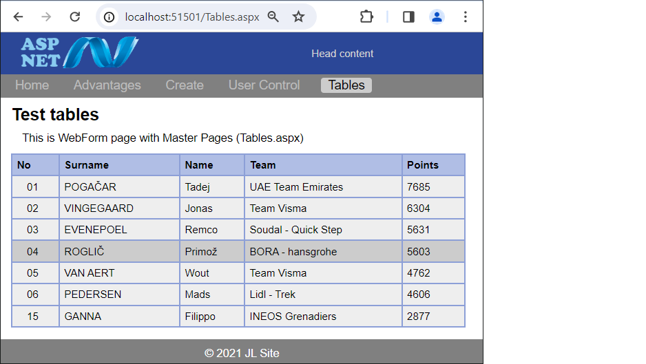
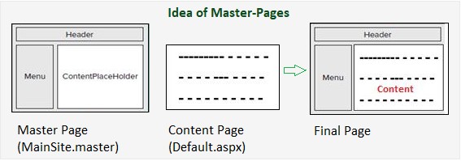

# WebForm page with Master-Pages

This WebForm page demonstrates using the Master-Pages technique to create uniform web page templates

## The idea of Master-Pages

It is often necessary for each of the many pages of a website to have a similar main layout: menu, title bar, footer, logo, which are unchanged for all subpages, and in one place, a window with content that changes for each subpage.
In the past, developers created consistent websites using custom controls, CSS, JavaScript and it was difficult.
That is why the following techniques were created: Razor-Page and the Master-Page described above.

## Description of Master-Pages:

Master Pages are used when user needs a consistent look and behavior over all web pages in an application. Master pages provide a template for all other pages in an application.

The master pages define placeholders for the content, which are overridden for the content. The result is combination of master and content page. Every master page has one or more content pages in an application.

## The advantages of the master page

- They provide an object model allowing users to customize the master page from the individual content pages.
- They allows user design the rendering of the controls in the placeholder
- It is centralized with common functionality of all pages to makes updates in one place
- Code can be applied on one set of controls and the results to the set of pages in the application

## User Control

A user control is a kind of composite control that works much like an ASP.NET 
Web page — you can add existing Web server controls and markup to a user control,
and define properties and methods for the control. You can then embed them in 
ASP.NET Web pages, where they act as a unit.

	The 'green' control defined in the file [WebUserControl1.ascx] attached to the current page [About.aspx]. 
    We can use UserControl in many places without 
    writing the same code again. For example, you can make a user control that has a label 
    and its text. We can drag and drop this control on any form and we will be able to see this label. 
